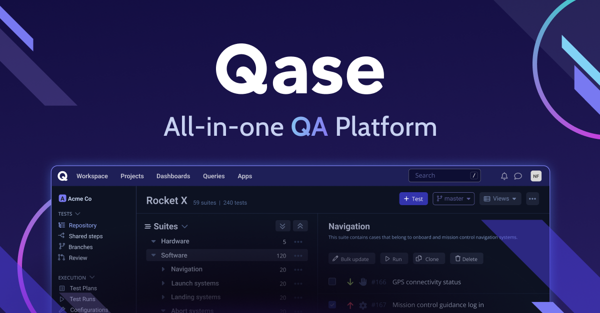
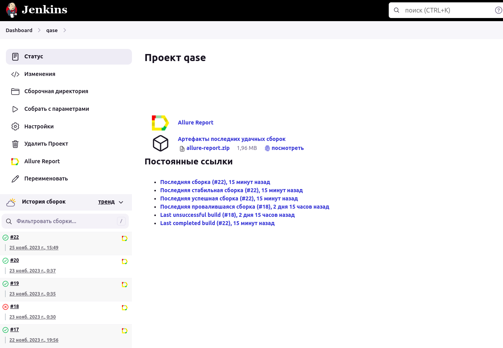
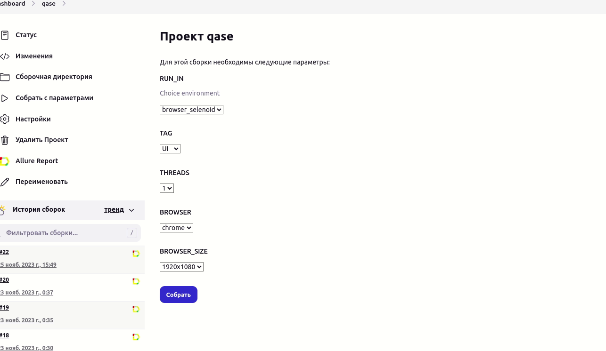
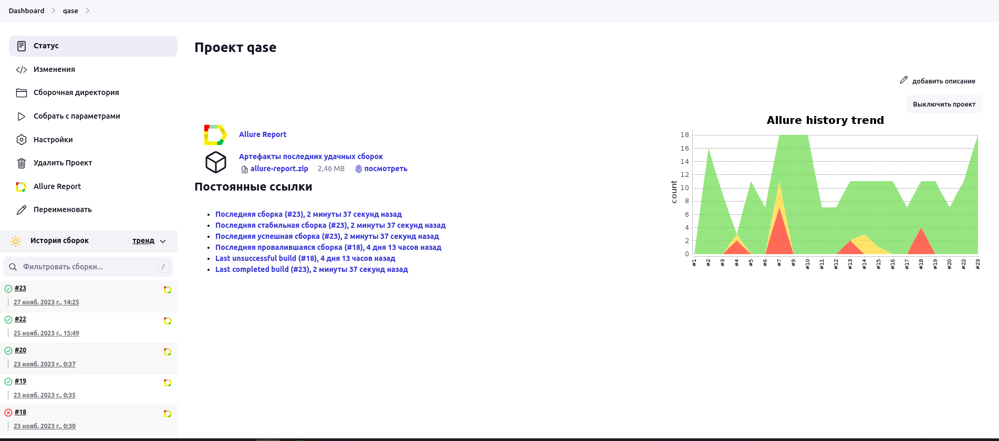
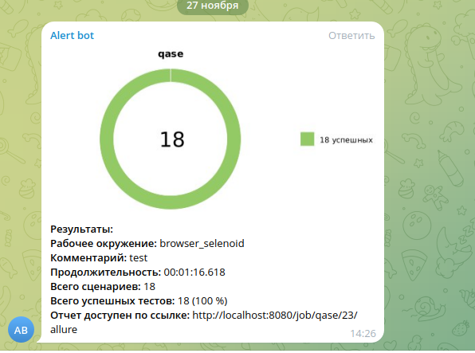
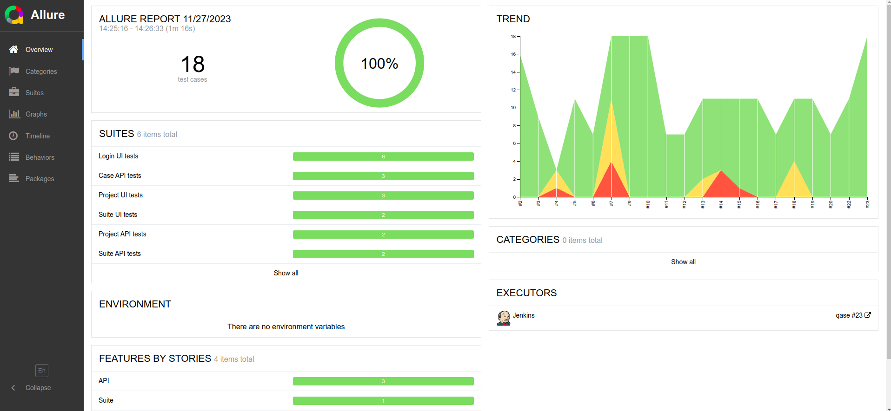
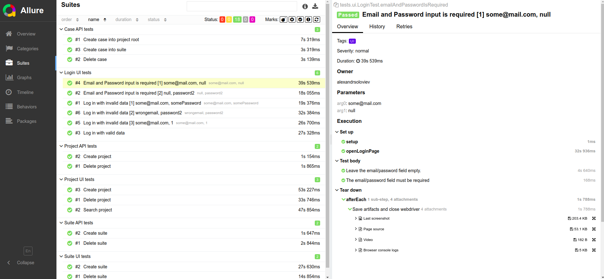
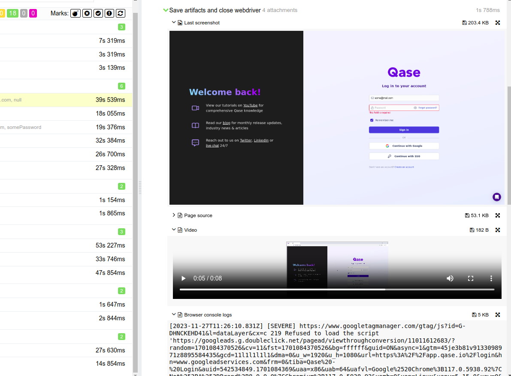

# Test automation project for service [QASE](https://app.qase.io/)

> Qase is a modern test management platform for manual + automated QA testing,\
> tracking, and reporting that helps deliver higher quality software, faster.
# <a name="TableOfContents">Table of contents</a>

 # <a name="Description">Description</a>
The test project consists of UI, API and mobile(android) tests.\
A brief list of interesting facts about the project:
- [x] `Page Object` with steps using `Chain of Invocations`
- [x] Fake data generating with `Faker` library
- [x] Parametrized tests
- [x] Parametrized build
- [x] Different configuration files for test running depending on build parameters
- [x] Config with `Owner` library
- [x] Using `Lombok` for models for API tests
- [x] Objects serialization/deserialization for API requests/responses using `Jackson`
- [x] Using request/response specifications for API tests
- [x] Custom Allure listener for beautiful API requests/responses logging
- [x] `Allure TestOps` integration
- [x] Autotests as test documentation
- [x] Parallel execution

# <a name="Technology">Tools and a technologies</a>
<p  align="center">
  <code></code>
  <code></code>
  <code></code>
  <code></code>
  <code></code>
  <code></code>
  <code></code>
  <code></code>
  <code></code>
  <code></code>
  <code></code>
  <code></code>
</p>

The autotests in this project are written in `Java` using `Selenide` framework.\
`Gradle` - is used as a build automation tool.  \
`JUnit5` - to execute tests.\
`REST Assured` - for easy API testing of REST services.\
`Jenkins` - CI/CD for running tests remotely.\
`Selenoid` - to remote launching browsers in `Docker` containers.\
`Allure Report` - for test results visualisation.\
`Telegram Bot` - for test results notifications.\


# <a name="HowToRun">How to run</a>

## <a name="GradleCommand">Gradle command</a>
To run locally and in Jenkins the following command is used:
```bash
gradle clean test -Dtag=<tag> -DrunIn=<runIn>
```
Additional parameters:
> `-Dthreads=number_of_threads` can be added for parallel tests execution

`tag` - tests with this tag will be executed:
>- *API*
>- *UI*


`runIn` - defines an environment for running these tests:
>- *\<not defined\>(for API tests)*
>- *browser_selenoid*
>- *browser_local*

> Additional properties are retrieved from the corresponding properties file(depending on `runIn` value):
```bash
./resources/config/project-${runIn}.properties
```

## <a name="PropertyFiles">Property files</a>
Possible properties in a `project-${runIn}.properties` file:
```properties
remoteDriver=
baseUrl=
browser=
browserSize=
```

>- *remoteDriver* - URL for remote WebDriver
>- *baseUrl* - base URL for UI tests
>- *browser* - browser for UI tests
>- *browserSize* - size of browser for running UI tests


### <a name="PropertyFilesDefaults">Default property files</a>
> The section below is automatically updated from content of src/test/resources/config/ directory.

<details>
    <summary><h4>UI</h4></summary>

* <details>
    <summary><h4>project-browser_selenoid.properties</h4></summary>

    <!-- MARKDOWN-AUTO-DOCS:START (CODE:src=./src/test/resources/config/project-browser_selenoid.properties) -->
    <!-- The below code snippet is automatically added from ./src/test/resources/config/project-browser_selenoid.properties -->
    ```properties
  remoteDriver=http://localhost:4444/wd/hub
  baseUrl=https://app.qase.io
  browser=chrome
  browserSize=1920x1080
    ```
    <!-- MARKDOWN-AUTO-DOCS:END -->

  </details>
* <details>
    <summary><h4>project-browser_local.properties</h4></summary>

    <!-- MARKDOWN-AUTO-DOCS:START (CODE:src=./src/test/resources/config/project-browser_local.properties) -->
    <!-- The below code snippet is automatically added from ./src/test/resources/config/project-browser_local.properties -->
    ```properties
  baseUrl=https://app.qase.io
  browser=chrome
  browserSize=1920x1080
    ```
    <!-- MARKDOWN-AUTO-DOCS:END -->

  </details>

</details>

## <a name="RunInJenkins">Run in [Jenkins](http://localhost:8080/job/qase/)</a>
Main page of the build:
<p  align="center">

</p>

A parametrized Jenkins job can be launched with needed ***tag*** and ***runIn***:
<p  align="center">

</p>

`project-{runIn}.properties` config files are created in the build workspace on start build.

Sensitive information(login names and passwords) is stored in an encrypted form in Jenkins credential storage.\
And relatively safe transferred to the build by gradle arguments(see [Gradle command](#GradleCommand) section, 'Additional parameters') and it's values masked in the logs.

After the build is done the test results are available in:
>- <code><strong>*Allure Report*</strong></code>

<p  align="center">

</p>

# <a name="TelegramNotifications">Telegram Notifications</a>
Telegram bot sends a brief report to a specified telegram chat by results of each build.
<p  align="center">

</p>


# <a name="AllureReport">Test results report in [Allure Report](https://65648130d64029392681ab59--cozy-pavlova-7f67f1.netlify.app/)</a>

## Main page
Main page of Allure report contains the following blocks:

>- <code><strong>*ALLURE REPORT*</strong></code> - displays date and time of the test, overall number of launched tests, а также диаграмму с указанием процента и количества успешных, упавших и сломавшихся в процессе выполнения тестов
>- <code><strong>*TREND*</strong></code> - displays trend of running tests for all runs
>- <code><strong>*SUITES*</strong></code> - displays distribution of tests by suites
>- <code><strong>*CATEGORIES*</strong></code> - displays distribution of unsuccessful tests by defect types
<p align="center">
  
</p>

## List of tests with steps and test artefacts
On the page the list of the tests grouped by suites with status shown for each test.\
Full info about each test can be shown: tags, severity, duration, detailed steps.

<p align="center">
  
</p>

Also additional test artifacts are available:
>- Screenshot
>- Page Source
>- Video
>- Browser console log

<p align="left">
  
</p>

# <a name="Video">Video of running tests</a>


https://github.com/alexandrsoloviev/Qase_ui_api_tests/assets/82815612/22752266-9c47-486d-8d18-cfc9146f173e


